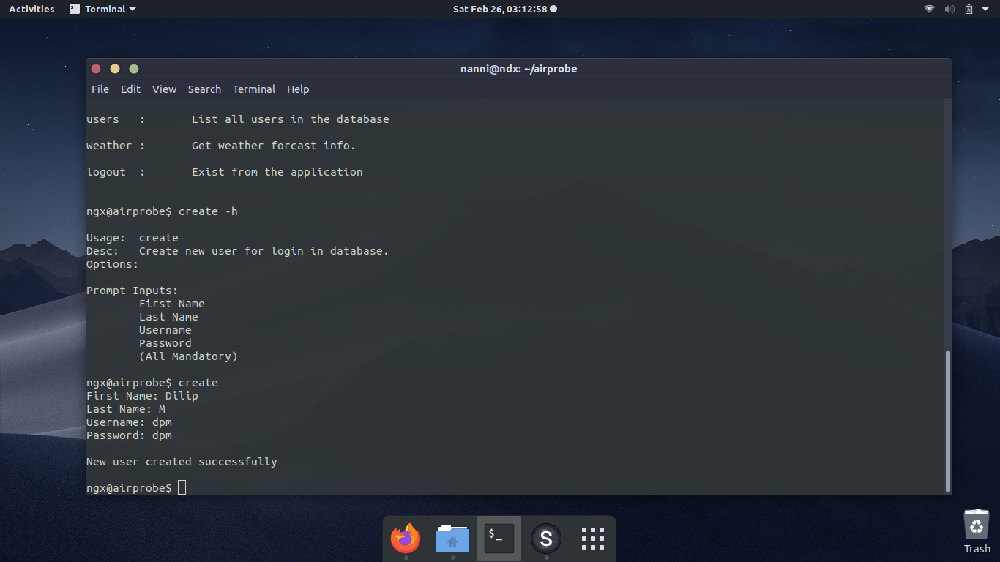

# weatherprobe
A CLI application with login to fetch weather report
### Installation
run provided `install.sh` or copy paste commands from it in the terminal manually.  
### Usage
`weatherprobe`
### Test Cases
`python3 weatherprobe/run_tests.py`
### Screenshots
  
   
   
   
